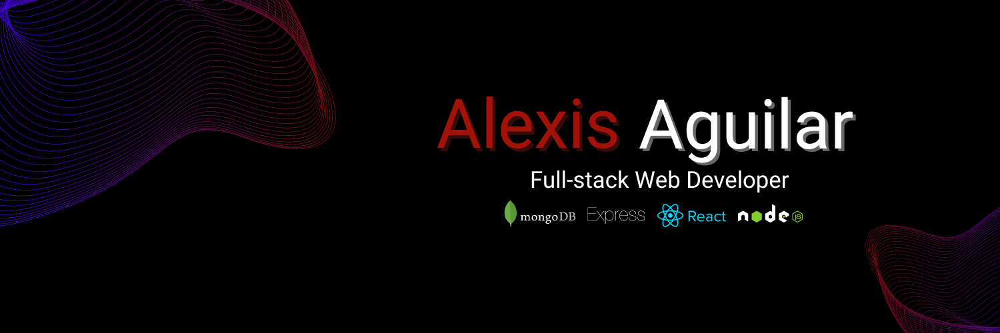

    

  
  
  
  

<!-- ABOUT ME -->

<h2 align="center" color="white">About Me 🖤</h2>

Hello! I'm Alexis and I'm an insatiably inquisitive web developer with a passion for problem-solving and being your shoulder to lean on. Currently targeting full-stack, frontend, or backend roles using React, JavaScript, TypeScript, Node, Express, MongoDB, and/or SQL DB's. Aside from programming, I enjoy music, personal and community development, constantly learning, and forever growing.

<!--

  

-->

 
 

<!-- PROJECTS -->

<h2 align="center" color="white">Projects</h2>

	<table>
		<tr>
			<td width="50%">
				<h3 align="center" color="white">Personal Portfolio</h2>
				
  
					
					 
					 
					

						  
							
					

					
<strong>React, Bootstrap, JavaScript</strong> - Come get to know me a little (or a lot!) and see a few of my projects.

				

			</td>
			<td width="50%">
				<h3 align="center" color="white">Mindfully</h2>
				
  
					
					 
					 
					

						  
							
					

					 
<strong>EJS, Bootstrap, Express, Node, MongoDB + Mongoose, JavaScript</strong> - A journaling app that encourages users to improve their mental health through practicing mindfulness.

				

			</td>
		</tr>
		<tr>
			<td width="50%">
				<h3 align="center" color="white">Seize The Day</h2>
				
  
					
					 
					 
					

						  
							
					

					
<strong>React, Material UI, Express, Node, MongoDB + Mongoose, JavaScript</strong> - An app for organizing your goals and accomplishments. 

				

			</td>
			<td width="50%">
				<h3 align="center" color="white">CSS Generators API</h2>
				
  
					
					 
					 
					

						  
							
					

					 
<strong>EJS, Express, Node, JavaScript</strong> - An API that provides a directory of efficacious websites that generate CSS design elements.

				

			</td>
		</tr>
	</table>
 
 

<!-- TECHNOLOGIES -->
 
<h2 align="center" color="white">Technologies</h2>

	
 
 
 
 
 
 
 
 
 
 
 
 
 
 

 
 

<!-- SOCIALS -->
 
<h2 align="center" color="white">Connect with me 🤍</h2>

  

    
    
    
    
  

 
 
