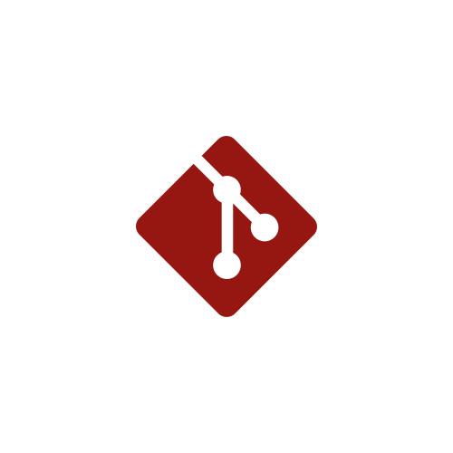

    

  
  
  

<!-- ABOUT ME -->

<h2 align="center" color="white">About Me 🖤</h2>

Hello! I'm Alexis and I'm a full stack software engineer passionate about delivering creative designs and organized, polished code. I love using my skills to make visions become reality. Aside from programming, I enjoy weight lifting, mental health advocation, constantly learning, and forever growing. #CommunityTaught

  

 
 

<!-- PROJECTS -->

<h2 align="center" color="white">Projects</h2>

	<table>
		<tr>
			<td width="50%">
				<h3 align="center" color="white">Personal Portfolio</h2>
				
  
					
					 
					 
					

						  
							
					

					
<strong>JavaScript, CSS3, HTML5</strong> - Portfolio site that showcases a few of my projects and includes ways to contact me.

				

			</td>
			<td width="50%">
				<h3 align="center" color="white">Tic Tac Toe</h2>
				
  
					
					 
					 
					

						  
							
					

					 
<strong>JavaScript, CSS3, HTML5</strong> - A 2–player tic-tac-toe game with win and draw validation

				

			</td>
		</tr>
	</table>
 
 

<!-- TECHNOLOGIES -->
 
<h2 align="center" color="white">Technologies</h2>

<table>
	<tr>
		<td valign="top" width="33.3333%">
			<h3 align="center" color="white">Frontend</h2>
			 
				
  
					
						&nbsp&nbsp&nbsp
					
						&nbsp&nbsp&nbsp
					
						&nbsp&nbsp&nbsp
					  
					

			</td>
			<td valign="top" width="33.3333%">
				<h3 align="center" color="white">Backend</h2>
				 
				

					&nbsp
					  
					&nbsp&nbsp&nbsp
					 
					&nbsp&nbsp&nbsp
					  
					&nbsp&nbsp&nbsp
					 
					&nbsp&nbsp&nbsp
					
					 
					 	
				

			</td>
			<td valign="top" width="33.3333%">	
				<h3 align="center" color="white">Other Software</h2>
				 
				

					&nbsp
					  
					&nbsp&nbsp&nbsp
					  
					&nbsp&nbsp&nbsp
					     	
					&nbsp&nbsp&nbsp
					   
				

			</td>
		</tr>
	</table>

 
 
