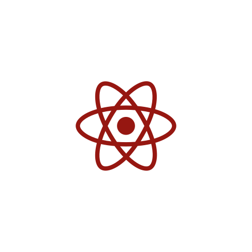

    

  
  
  

## About Me 🖤

* 👋 Hi, I'm Alexis! 
* 🥀 Located in Florida, USA. 
* 💻 Software Engineer at 100Devs. 
* 🗡️ Currently tackling the MERN stack. 

## Technologies

## Network with me ⬇ 
❤️ [Twitter](https://twitter.com/alexisintech) 

❤️ [Linkedin](https://www.linkedin.com/in/alexisintech)

## Read about my coding journey:
🖊️ [My blog](https://alexisintech.wixsite.com/blog)

<!-- TECHNOLOGIES -->
 
<h2 align="center" color="white">Technologies</h2>

<table>
	<tr>
		<td valign="top" width="33.3333%">
			<h3 align="center" color="white">Frontend</h2>
			 
				
  
					
						&nbsp&nbsp&nbsp
					
						&nbsp&nbsp&nbsp
					
						&nbsp&nbsp&nbsp
					  
					

			</td>
			<td valign="top" width="33.3333%">
				<h3 align="center" color="white">Backend</h2>
				 
				

					&nbsp
					  
					&nbsp&nbsp&nbsp
					 
					&nbsp&nbsp&nbsp
					  
					&nbsp&nbsp&nbsp
					 
					&nbsp&nbsp&nbsp
					
					 
					 	
				

			</td>
			<td valign="top" width="33.3333%">	
				<h3 align="center" color="white">Other Software</h2>
				 
				

					&nbsp
					  
					&nbsp&nbsp&nbsp
					 
					&nbsp&nbsp&nbsp
					   	
                    &nbsp&nbsp&nbsp
                       	
				

			</td>
		</tr>
	</table>

 
 

<!-- CONTACT -->

<h2 align="center" color="white">Let's connect!</h2>

	
	&nbsp&nbsp&nbsp
	
	&nbsp&nbsp&nbsp
	

